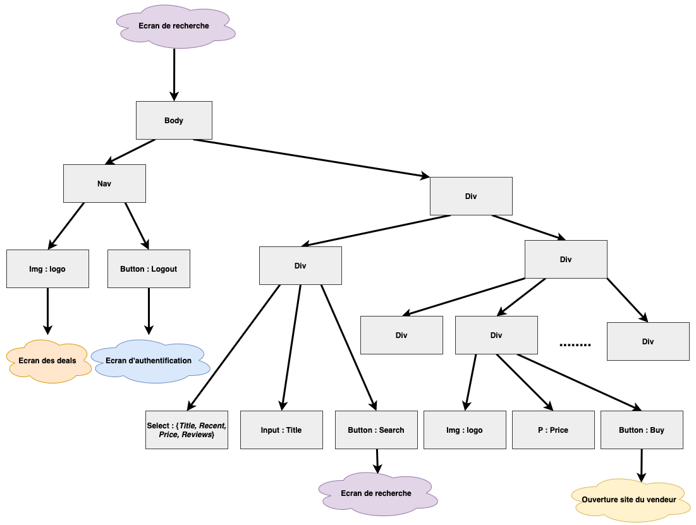

# Cahier des charges de l'application GameDeal

## Sujet de l’application GameDeal

GameDeal est une plateforme de comparaison de prix de jeux vidéo pour pc qui propose aux utilisateurs les meilleurs prix d’un jeu précis sur les diverses plateformes de distribution existantes et de pouvoir les acheter en ligne ou laisser des review dessus.

## Principales fonctionnalités

* Inscription et authentification.
* Visionnage des deals du moment sur les diverses plateformes de distribution.
* Recherche de jeux par titre.
* Classer les résultats d'une recherche par : *titre*, *prix*, *date de sortie* ou *note*.
* Visionnage des prix d’un jeu dans les divers store en ligne.
* Review sur un jeu.
* Redirection vers un store pour l’achat d’un jeu sur une plateforme précise.

## Description de l’API

**CheapShark** est un site de comparaison de prix pour les jeux vidéo pc qui propose une API gratuite appelée en réponse aux requêtes d'un utilisateur. Le site suit les prix dans plusieurs magasins en ligne, notamment Steam, GreenManGaming, Fanatical, Origin et d'autres.

La documentation de cette API peut être consultée [ICI](https://apidocs.cheapshark.com/).

Les requêtes sur cette API renvoie des JSON de la forme :

```json
{
    "gameID": "146",
    "steamAppID": "35140",
    "cheapest": "5.00",
    "cheapestDealID": "n96QeQ9FLRDoZToO75BS2Dx22PPtc7hlpcehVxUlW2c%3D",
    "external": "Batman: Arkham Asylum Game of the Year Edition",
    "thumb": "https://steamcdn-a.akamaihd.net/steam/apps/35140/capsule_sm_120.jpg?t=1525990900"
}
```

Ce qui permet une manipulation assez facile de ces données.

## Cas d’utilisation

### Inscription

Un client arrive sur le site, il appuie sur **“Sign up”**, le formulaire d'inscription s’affiche, le client le remplit et le soumet, il est redirigé vers l'écran d'authentification où il pourra se connecter.

### Authentification

Un client déjà inscrit sur le site remplit le formulaire de connexion et appuie sur **“Login”**, il est redirigé vers l'écran des deals du moment.

### Vision d'un deal

Un client connecté sur l'écran des deals (écran d'accueil) appuie sur un des deal, la fenêtre d'information sur le jeu s'affiche avec son prix en promotion, son prix original, les commentaires laissés par les autres utilisateur ainsi qu'un bouton **"Buy"**.

### Achat d'un deal

Un client connecté sur l'écran des deals (écran d'accueil) appuie sur un des deal, la fenêtre d'information sur le jeu s'affiche, il appuie sur le bouton **buy**, il est redirigé vers le site du vendeur.

### Recherche d’un jeu

Un client connecté écrit le titre du jeu dans la barre de recherche, le site lui propose tous les jeux contenant le titre donné en entrée avec leurs prix, il choisit le jeu qui l’intéresse, il est redirigé vers le store.

## Base de données

### Table des utilisateurs (Users)

* Identifiant (id) : *int*.
* Prenom (firstname) : *varchar*.
* Nom (lastname) : *varchar*.
* Nom d’utilisateur (login) : *varchar*.
* Mot de passe (password) : *blob*.
* addresse mail (email) : *varchar*.

### Table des commentaires (Comments)

* Identifiant du commentaire (commentID) : *int*.
* Identifiant de l’utilisateur (userId) : *int*.
* Texte du commentaire (comment) : *text*.
* Identifiant du jeu (gameId) : *int*.
* Date de publication du commentaire (date) : *text*


## Mise à jour des données

### Table des utilisateurs

À chaque nouvelle inscription.

### Table des commentaires

À chaque nouveau commentaire sur un jeu.

## Appel de l’API externe

Lors de :

* La connexion pour afficher les deals du moment.
* La recherche d’un jeu.
* L'accès à un deal.
* L'accès à un jeu.
* La redirection vers un site vendeur.

## Description du serveur

En approche **REST**, on a :

* AuthentificationServlet : ce service authentifie un utilisateur.
* CommentServlet : ce service gère les commentaires.
* DealsServlet : ce service affiche les deals du moment lorsqu'un utilisateur se connecte.
* InscriptionServlet : ce service inscrit un nouvel utilisateur.
* RechercheServlet : ce service lance la recherche d'un jeu.

## Description du client

Notre application est monopage dans laquelle selon l’état de l’application les bons composants seront affichés :

* Écran d’authentification -> appel à *AuthentificationServlet*.
* Écran d’inscription appel -> à *InscriptionServlet*.
* Écran d’accueil : affichage ds deals du moment, une barre de recherche et un bouton de déconnexion -> appel à *DealsServlet*.
* Écran de recherche : affichage des résultats d’une recherche -> *RechercheServlet*.
* Écran d’un deal : affichage du prix du jeu en promotion et son prix original, les commentaires et ainsi qu’un champ d’ajout de commentaires et un bouton d’achat  -> Appel à  *CommentServlet*.

Les différents écrans qu'on a sont :

* L'écran d'acceuil qui permet l'authentification :


* L'écran d'inscription :


* L'écran des deals qui s'affiche après la connexion de l'utilisateur :


Où on remarque :

* Une barre de recherche qui permet d'organiser les résultats dans un certain ordre :


Et une recherche affiche :


* Les deals du moment, qui affichent un nouvel écran si nous appuions sur l'un d'eux :


L'écran d'un deal contient aussi un champ pour écrire un commentaire ainsi que l'historique des commentaires :


## Description des requêtes

Les requêtes qui vise **login, signup, comments** sont traiter par notre serveur qui interroge la base de données afin de produire un résultat. Pour ce qui concerne  **deals, recherche, jeux** dès que requête est destiner à une de ces ressources notre serveur contacte l'API distant qui lui fourni les données demandées. Dans les deux cas notre serveur nous rend la réponse sous forme d'un JSON, ce dernier sera ensuite traiter dans le frontend pour faire le rendu de la page courrante. 

1. Authentification
	```http
	POST http://localhost:8081/GameDeals/login?username=adminGM&password=admingGM
	```
	Réponse
	```json 
	{username:"adminGM", id:1}
	```

2. Inscription
	```http
	POST http://localhost:8081/GameDeals/signup?username=john25&password=123456&firstname=John&lastname=Smith&confirmpasswordd=123456&email=john@gmail.com
	```
	Réponse
	```json 
	{username:"john25", id:25}
	```

3. Les deals du moment
	```http
	GET http://localhost:8081/GameDeals/deals?sortBy=Price&pageSize=60
	```
	Réponse
	
	```json 
		
	[{
	   "internalName": "DEUSEXHUMANREVOLUTIONDIRECTORSCUT",
	   "title": "Deus Ex: Human Revolution - Director's Cut",
	   "metacriticLink": "/game/pc/deus-ex-human-revolution---directors-cut",
	   "dealID": "HhzMJAgQYGZ%2B%2BFPpBG%2BRFcuUQZJO3KXvlnyYYGwGUfU%3D",
	   "storeID": "1",
	   "gameID": "102249",
	   "salePrice": "2.99",
	   "normalPrice": "19.99",
	   "isOnSale": "1",
	   "savings": "85.042521",
	   "metacriticScore": "91",
	   "steamRatingText": "Very Positive",
	   "steamRatingPercent": "92",
	   "steamRatingCount": "17993",
	   "steamAppID": "238010",
	   "releaseDate": 1382400000,
	   "lastChange": 1621536418,
	   "dealRating": "9.6",
	   "thumb": "https://cdn.cloudflare.steamstatic.com/steam/apps/238010/capsule_sm_120.jpg?t=1619788192"
	 },
	 {
	   "internalName": "THIEFDEADLYSHADOWS",
	   "title": "Thief: Deadly Shadows",
	   "metacriticLink": "/game/pc/thief-deadly-shadows",
	   "dealID": "EX0oH20b7A1H2YiVjvVx5A0HH%2F4etw3x%2F6YMGVPpKbA%3D",
	   "storeID": "1",
	   "gameID": "396",
	   "salePrice": "0.98",
	   "normalPrice": "8.99",
	   "isOnSale": "1",
	   "savings": "89.098999",
	   "metacriticScore": "85",
	   "steamRatingText": "Very Positive",
	   "steamRatingPercent": "81",
	   "steamRatingCount": "1670",
	   "steamAppID": "6980",
	   "releaseDate": 1085443200,
	   "lastChange": 1621540561,
	   "dealRating": "9.4",
	   "thumb": "https://cdn.cloudflare.steamstatic.com/steam/apps/6980/capsule_sm_120.jpg?t=1592493801"
	 },
	 {
	   "internalName": "JUSTCAUSE2",
	   "title": "Just Cause 2",
	   "metacriticLink": "/game/pc/just-cause-2",
	   "dealID": "z4El8C19yCEHrk1%2ByEedebThQVbblI7H0Z%2BAmxgZiS8%3D",
	   "storeID": "1",
	   "gameID": "180",
	   "salePrice": "1.49",
	   "normalPrice": "14.99",
	   "isOnSale": "1",
	   "savings": "90.060040",
	   "metacriticScore": "84",
	   "steamRatingText": "Very Positive",
	   "steamRatingPercent": "90",
	   "steamRatingCount": "35296",
	   "steamAppID": "8190",
	   "releaseDate": 1269302400,
	   "lastChange": 1621536477,
	   "dealRating": "9.4",
	   "thumb": "https://cdn.cloudflare.steamstatic.com/steam/apps/8190/capsule_sm_120.jpg?t=1593180404"
	   }
	```
4. Visualiser un deal
	```http
	GET http://localhost:8081/GameDeals/deals?id=
	z4El8C19yCEHrk1%2ByEedebThQVbblI7H0Z%2BAmxgZiS8%3D
	```

	Réponse
```json 
{
    "internalName": "JUSTCAUSE2",
    "title": "Just Cause 2",
    "metacriticLink": "/game/pc/just-cause-2",
    "dealID": "z4El8C19yCEHrk1%2ByEedebThQVbblI7H0Z%2BAmxgZiS8%3D",
    "storeID": "1",
    "gameID": "180",
    "salePrice": "1.49",
    "normalPrice": "14.99",
    "isOnSale": "1",
    "savings": "90.060040",
    "metacriticScore": "84",
    "steamRatingText": "Very Positive",
    "steamRatingPercent": "90",
    "steamRatingCount": "35296",
    "steamAppID": "8190",
    "releaseDate": 1269302400,
    "lastChange": 1621536477,
    "dealRating": "9.4",
    "thumb": "https://cdn.cloudflare.steamstatic.com/steam/apps/8190/capsule_sm_120.jpg?t=1593180404"
}]
```
5. Recherche
	```http
	GET http://localhost:8081/GameDeals/deals?title=FIFA&sortBy=DealRating
    ```
    Réponse
    ```json
	     [{
      "internalName":"EASPORTSFIFA21",
      "title":"EA SPORTS FIFA 21",
      "metacriticLink":null,
      "dealID":"glbOxA0wGTVcY20tEZREuTQxJG94hl7F00Uzw2Lh3UY%3D",
      "storeID":"1",
      "gameID":"217198",
      "salePrice":"19.99",
      "normalPrice":"79.99",
      "isOnSale":"1",
      "savings":"75.009376",
      "metacriticScore":"0",
      "steamRatingText":"Mostly Positive",
      "steamRatingPercent":"73",
      "steamRatingCount":"25803",
      "steamAppID":"1313860",
      "releaseDate":0,
      "lastChange":1621881383,
      "dealRating":"5.5",
      "thumb":"https:\/\/cdn.cloudflare.steamstatic.com\/steam\/apps\/1313860\/capsule_sm_120.jpg?t=1619546605"
   },
   {
      "internalName":"FIFAPOINTS4600",
      "title":"FIFA Points 4600",
      "metacriticLink":null,
      "dealID":"cYEAmbPXbjfEBVi%2BW37RlJq2Mmxb5OSvNSDeBxjKaos%3D",
      "storeID":"8",
      "gameID":"205312",
      "salePrice":"39.99",
      "normalPrice":"39.99",
      "isOnSale":"0",
      "savings":"0.000000",
      "metacriticScore":"0",
      "steamRatingText":null,
      "steamRatingPercent":"0",
      "steamRatingCount":"0",
      "steamAppID":null,
      "releaseDate":0,
      "lastChange":1568817105,
      "dealRating":"0.0",
      "thumb":"https:\/\/originassets.akamaized.net\/origin-com-store-final-assets-prod\/194927\/142.0x200.0\/1077645_MB_142x200_en_WW (7)_^_2019-08-26-21-00-54_7088706741aba1bdccd3bda976d76fd23ccca5d1.jpg"
   }]
    ```
6. Commentaires	
	```http
	GET http://localhost:8081/GameDeals/comments?gameId=15795
	```
	Réponse
	````json 
		{id:1,
		author:"gamer2584",
		date: "mardi 25 mai 2021 11:18:28 GMT+02:00",
		text:"Awsome Game!!!"
		}...
	````
	Ajout
	```http
	POST http://localhost:8081/GameDeals/comments?gameId=15795&author=john25&text=Enjoyed it
	```
	Réponse
	```json 
	[
		{id:1,
		author:"gamer2584",
		date: "mardi 25 mai 2021 11:18:28 GMT+02:00",
		text:"Awsome Game!!!"
		}, 
		{id:2, 
		 author:"john25",
		 date:"mardi 25 mai 2021 11:30:00 GMT+02:00",
		 text:"Enjoyed it"
		 }
	]
	```

## Design de l'application


## DOM

Les différentes structures du DOM sont :

Lors du lancement du site (l'écran d'authentification) :


Lorsque le client appuie sur *Sign Up* (l'écran d'inscription) :


Lorsque le client se connecte (l'écran des deals) :


Lorsque le client fait une recherche (l'écran de recherche) :



Lorsque le client appuie sur un jeu (l'écran d'un deal) :


